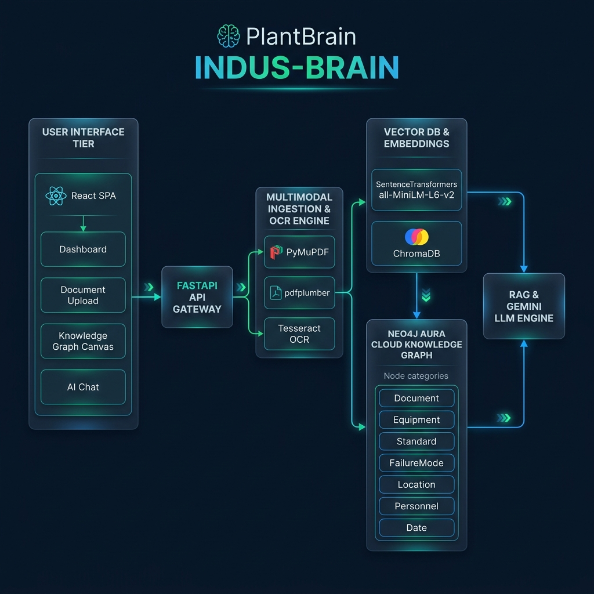

# PlantBrain (INDUS-BRAIN) — System Architecture Blueprint 🌿🧠⚡

---

## 🏛️ Subsystem Architectural Summary

1. **User Interface Tier (`frontend/`)**:
   React.js 18 + Vite 6 dark-mode SPA featuring interactive graph rendering, dropzone uploading, RAG chat, and pipeline telemetry dashboards.

2. **Multimodal Parsing & Ingestion Engine (`backend/app/ingestion/`)**:
   PyMuPDF digital text extraction, pdfplumber table parsing, and Tesseract OCR for scanned diagrams. Normalizes document raw text into `storage/parsed_docs/DOC-*.json`.

3. **Vector DB & Embeddings Subsystem (`backend/app/embeddings/`)**:
   Chunks parsed text into 500-word sliding windows, generates 384-dimensional dense vectors using SentenceTransformers (`all-MiniLM-L6-v2`), and stores 1,790+ vectors in ChromaDB (`storage/chroma_db`). Employs Filename-Aware filtering for targeted document retrieval.

4. **Neo4j Cloud Knowledge Graph Engine (`backend/app/graph/`)**:
   Connected to **Neo4j Aura Cloud Instance** (`neo4j+s://e4d95fb2.databases.neo4j.io`). Houses 7 node categories and 3 relationship edge types, supporting fast Cypher 1-hop traversals and graph topology exports.

5. **RAG & LLM Intelligence Engine (`backend/app/rag/`)**:
   Formats retrieved context passages, constructs guardrailed prompts, and queries Google Gemini API (`gemini-1.5-flash`), with fallback to a local grounded Smart NLP Synthesizer.

6. **Compliance & Debug Telemetry Suite (`backend/app/compliance/` & `backend/app/api/`)**:
   Audits plant entities against OSHA 1910, ASME Boiler Code, and ISO 55001 rules defined in `rules.json`, exposed via 5 REST debug endpoints (`/debug/*`).
